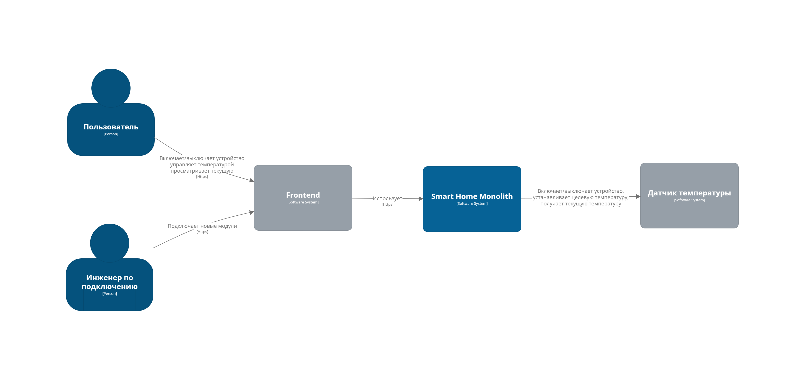
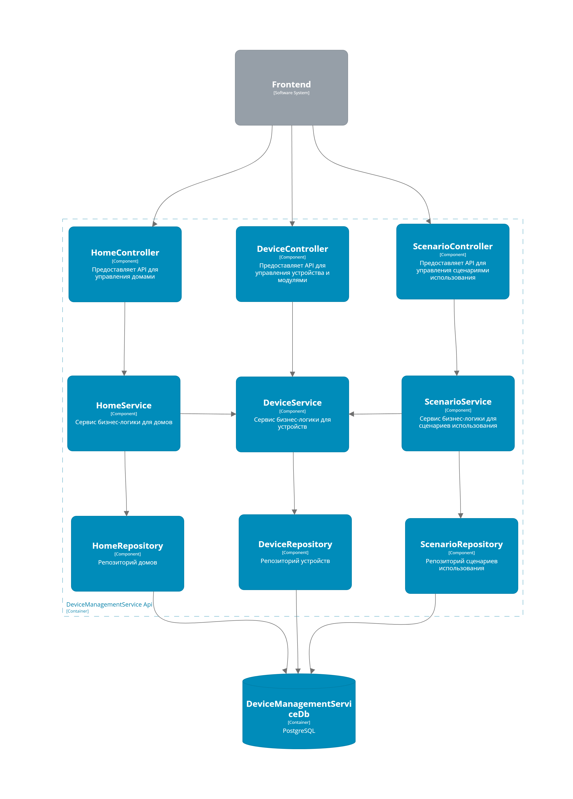
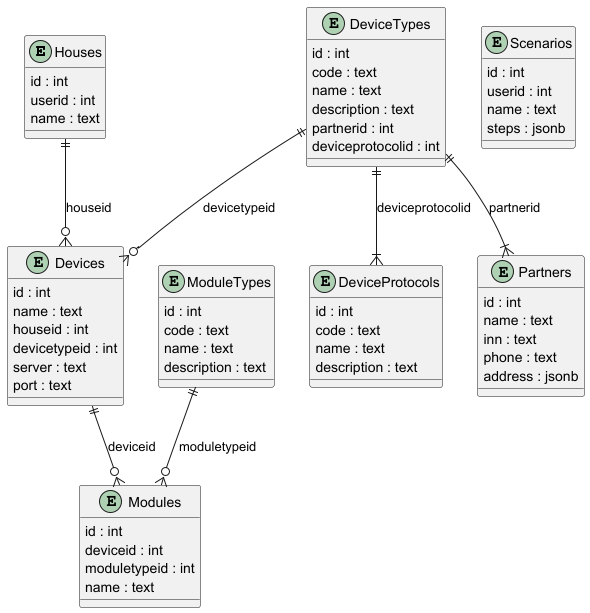

# Stay Home Platform. Домашнее задание 3

## AsIs. Монолит

### Функциональность

* Управление отоплением
  * пользователи удаленно включают и выключают отопление в доме
  * пользователи могут устанавливать желаемую температуру
  * система автоматически поддерживает заданную температуру
* Мониторинг температуры
  * Система получает температуру с датчиков, установленных в домах
  * Пользователи могут просматривать текущую температуру в своих домах через сайт

### Архитектура

* Монолитная система
* Стек: Java/PostgreSQL
* Полностью синхронное взаимодействие между всеми компонентами системы (Frontend, Backend, устройства)
* Ограниченная масштабируемость
* Развертывание требует полной остановки всего приложения

Схема C4:



### Домены приложения

* домен "Управление устройствами"
* домен "Мониторинг"
* домен "Управление пользователями"


## ToBe. Микросервисная архитектура 

Схема C4 (Container View):


**Основные микросервисы:**

+ `AuthService` - aутентификация и авторизация
+ `UserProfileService` - управление пользовательскими профилями
+ `DeviceManagementService` - управление устройствами
+ `MonitoringService` - взаимодействие с показаниями устройств
+ `TelemetryHub` - организация хранения показаний
+ `TelemetryCollector` - опрос устройств и отправка показаний в Кафка
+ `DeviceController` - взаимодействие с устройством
+ `NotificationService` - уведомления пользователей через почту, смс

Схема C4 (DeviceManagementService. Component View):



### DeviceManagementService. ERD



**Основные сущности:**

+ `Houses` - дом
+ `Partners` - партнеры
+ `DeviceTypes` - типы устройств
+ `DeviсeProtocols` - протоколы устройств
+ `Devices` - устройства
+ `ModuleTypes` - типы модулей
+ `Modules` - модули
+ `Scenarios` - сценарии использования

*Подробнее про сценарии использования:*

Каждый сценарий состоит из последовательности шагов. Каждый шаг хранится в формате json, структура:

```json
{
  "Steps": [
    {
      "ModuleId": "int",                   // Идентификатор модуля
      "TargetMeasurement": "double",       // Целевое показание
      "Schedule": "text (cron format)"     // Расписание   
    }
  ]
}
```


