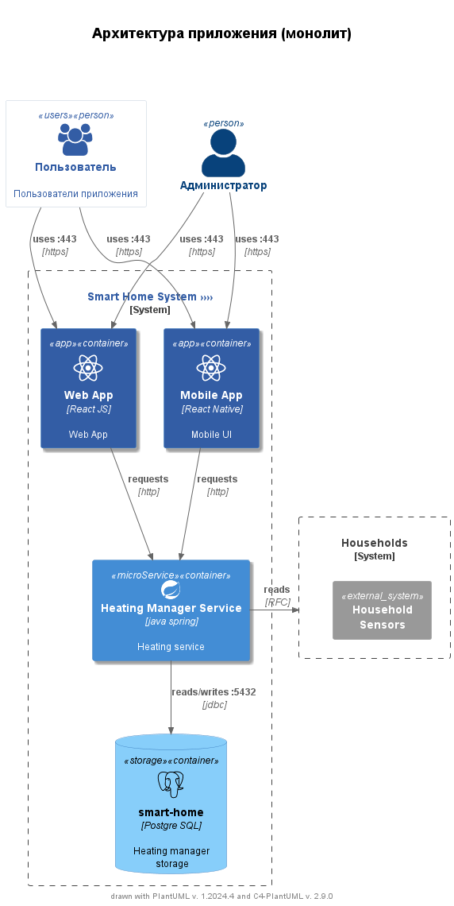
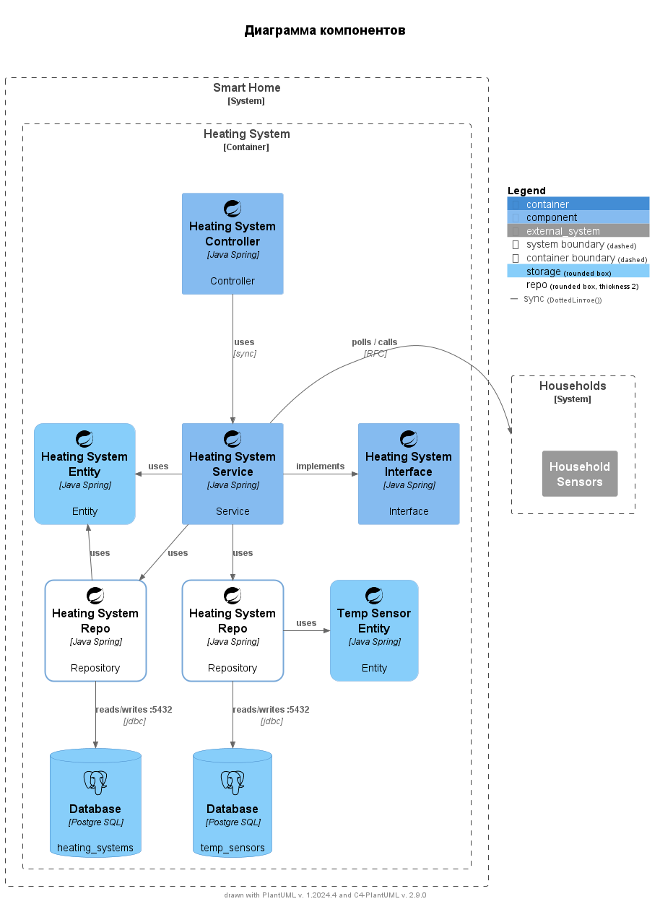

# Текущее состояние

## Описание функциональности текущего монолитного приложения

### Функциональные возможности
- Управление отоплением в доме (включение/выключение, регулировка температуры).
- Получение данных о текущей температуре в доме.

### Процесс подключения
- Каждая установка системы требует выезда специалиста для подключения системы отопления к текущей версии платформы.
- Пользователь не имеет возможности самостоятельно подключить датчики к системе.

### Ограничения и проблемы
- Невозможность масштабирования текущего решения для поддержки новых бизнес-целей.
- Ограниченные функциональные возможности, отсутствие поддержки других устройств умного дома.
- Отсутствие автоматизации и реактивных взаимодействий в системе.

## Анализ архитектуры монолитного приложения

### Диаграмма контекста

### Диаграмма компонентов

### Архитектура:
- **Язык программирования:** `Java`.
- **СУБД:** `PostgreSQL`.
- **Взаимодействие:** Все взаимодействия между компонентами системы синхронны.
- **Характеристики:**
    - Монолитная архитектура.
    - Отсутствие микросервисов и асинхронных вызовов.
    - Сервер выполняет все управляющие функции и непосредственно взаимодействует с датчиками.

### Масштабируемость
- **Проблемы с масштабированием:**
    - Монолитная структура затрудняет добавление новых функций и модулей.
    - Система не поддерживает гибкое и динамическое подключение новых устройств.
- **Риски:**
    - Увеличение нагрузки на систему при добавлении новых домов и устройств приведёт к ухудшению производительности.

### Развертывание
- Развертывание текущей системы требует значительных усилий и часто требует вмешательства специалистов для установки и настройки.

## Заключение
Текущая монолитная архитектура и синхронное взаимодействие системы существенно ограничивают её способность к масштабированию и расширению функционала, что делает невозможным реализацию новой экосистемы умного поселка в рамках существующего решения.

## Микросервисы: analysis/analysis.md

## ER-диаграмма: analysis/diagram.md

