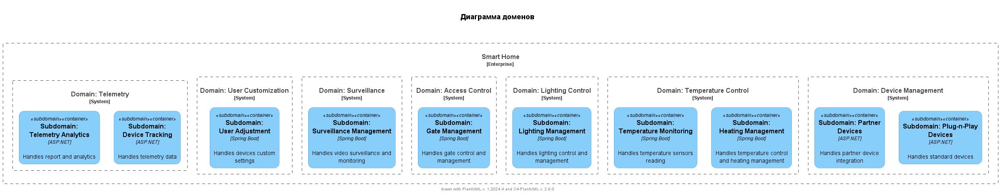

# Описание доменов

## Диаграмма доменов smart-home

### Домен: Управление устройствами
- **Поддомен: Устройства Plug-n-Play**
    - **Технология**: `ASP.NET`
    - **Описание**: Управляет стандартными устройствами в экосистеме умного дома.

- **Поддомен: Устройства партнеров**
    - **Технология**: `ASP.NET`
    - **Описание**: Интегрирует и управляет устройствами от внешних партнеров.

### Домен: Контроль температуры
- **Поддомен: Управление отоплением**
    - **Технология**: `Spring Boot`
    - **Описание**: Управляет системами отопления и настройками температуры.

- **Поддомен: Мониторинг температуры**
    - **Технология**: `Spring Boot`
    - **Описание**: Мониторит и считывает данные с датчиков температуры.

### Домен: Управление освещением
- **Поддомен: Управление освещением**
    - **Технология**: `Spring Boot`
    - **Описание**: Управляет системами освещения в умном доме.

### Домен: Контроль доступа
- **Поддомен: Управление воротами**
    - **Технология**: `Spring Boot`
    - **Описание**: Управляет воротами и системами доступа.

### Домен: Видеонаблюдение
- **Поддомен: Управление видеонаблюдением**
    - **Технология**: `Spring Boot`
    - **Описание**: Управляет системами видеонаблюдения и мониторинга.

### Домен: Персонализация пользователя
- **Поддомен: Настройки пользователя**
    - **Технология**: `Spring Boot`
    - **Описание**: Обрабатывает настройки и персонализацию устройств для пользователей.

### Домен: Телеметрия
- **Поддомен: Отслеживание устройств**
    - **Технология**: `ASP.NET`
    - **Описание**: Управляет и отслеживает данные телеметрии от устройств.

- **Поддомен: Аналитика телеметрии**
    - **Технология**: `ASP.NET`
    - **Описание**: Предоставляет аналитику и отчеты на основе данных телеметрии.
